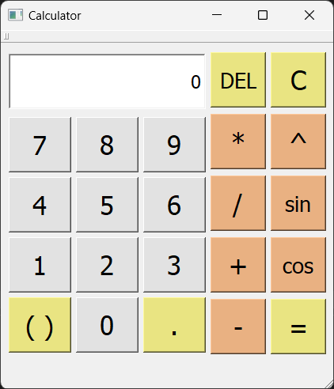

# Calculator App

Приложение-калькулятор для вычисления математических выражений, разработанное на C++ с использованием Qt 5.14.

## Задание

Реализовать программу в виде оконного приложения, реализующего ввод математического выражения, его обработку, вычисление и вывод на экран результата.
Набор операторов - сложение, вычитание, умножение, деление.
Функции - взятие синуса, взятие косинуса, возведение в степень. 
Язык программирования - C++.
Разрешается использовать любые доступные фреймворки для построения оконных приложений на C++.
Запрещается использовать готовые библиотечные решения для обработки математических выражений.

## Описание

Приложение представляет собой графический калькулятор, который позволяет пользователю вводить математические выражения, обрабатывать их и получать результат вычислений. Калькулятор поддерживает базовые арифметические операции и математические функции.

### Возможности

- **Базовые арифметические операции**:
  - Сложение (`+`)
  - Вычитание (`-`)
  - Умножение (`*`)
  - Деление (`/`)

- **Математические функции**:
  - Синус (`sin()`)
  - Косинус (`cos()`)
  - Возведение в степень (`^`)

## Требования

- **Язык программирования**: C++17
- **Фреймворк**: Qt 5.14.2
- **Сборка**: CMake 3.16+

## Структура проекта

- **CalculatorApp/**
  - `CMakeLists.txt` - Файл конфигурации CMake
  - `README.md` - Документация проекта
  - **src/**
    - `main.cpp` - Точка входа в приложение
    - `Calculator.cpp` - Реализация логики калькулятора
    - `Calculator.h` - Заголовочный файл калькулятора
    - `Calculator.ui` - Файл интерфейса
    - `Calculator.qrc` - Ресурсы приложения
  - **build/** - Директория сборки

## Комментарии к реализации

1. Программа реализована таким образом, чтобы пользователь мог вводить только разрешенные комбинации символов. Например, первым знаком в выражении не может быть знак умножения.

2. Расстановка скобок в выражении также автоматическая. При нажатии на кнопку программа сама поставит необходимую скобку в выражении.

3. Максимальная точность выводимых чисел: 6 знаков после запятой.

# Клонирование и сборка

## 1. Клонирование репозитория

```bash
git clone https://github.com/KeySi3/Calculator.git
cd CalculatorApp
```

## 2. Сборка проекта

```bash
mkdir build && cd build
cmake ..
cmake --build .
```

## 3. Запуск приложения

```bash
# Linux / macOS
./CalculatorApp

# Windows
CalculatorApp.exe
```

<p align="center">
  
  <br>
  <em>Внешний вид приложения</em>
</p>
